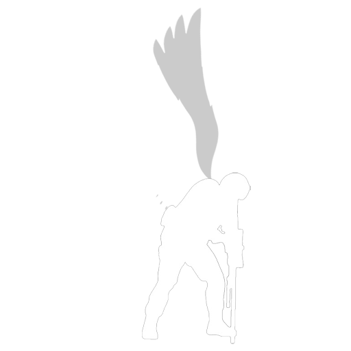

# INSANE.tf2
## ⚠️ For education purposes only. Do not use in live matches.

### ⚙️ **Requirments to build** 
- MSVC compiler

---
### ✅ **How to build**
1. Run `CreateBuildFiles.bat` to create CMake build files and some folders.
2. Run `BuildDebug.bat` or `BuildRelease.bat` to build debug or release build respectively.
3. Done. 🙂

---
### 🗿 **How to Run**
1. Don't.
2. Use any manual map injector.

---
### **How to use**
1. Don't
2. Dll should be in the `./Output/Release/` and `./Output/Debug/` folder depending on whether you use `BuildDebug.bat` or `BuildRelease.bat`. 

NOTE : It might be rough around the edges and some features might not working at all, I am not very smart. 
Also please don't mind poorly written code in some places. 
